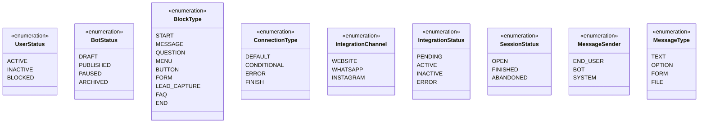
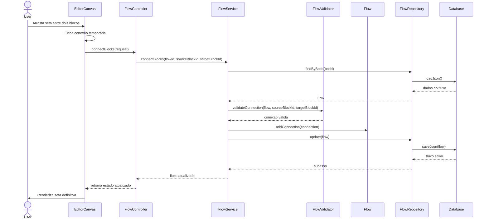

# Modelagem de Classes e Relacionamentos - HelloHub

## 1. Contexto da Modelagem

Esta modelagem dá continuidade à primeira etapa do projeto HelloHub, na qual foi definida como funcionalidade principal o **Construtor Visual de Fluxo Drag & Drop**.

A funcionalidade central permite que o usuário crie a lógica de conversa de um chatbot conectando blocos visuais por meio de setas. Dessa forma, o fluxo de conversa é representado como um grafo, no qual:

- **Block** representa cada nó do fluxo;
- **Connection** representa cada seta entre dois blocos;
- **Flow** representa o conjunto completo de blocos e conexões;
- **Bot** agrega o fluxo e demais configurações do chatbot;
- **User** representa o usuário autenticado que cria e gerencia bots.

A modelagem também considera a organização arquitetural definida no warmup:

```text
Usuário
   ↓
EditorCanvas / FlowEditorView
   ↓
FlowController
   ↓
FlowService
   ↓
FlowValidator / Flow
   ↓
FlowRepository
   ↓
Database
```

Essa separação evita que uma única classe concentre responsabilidades de interface, regra de negócio, validação e persistência.

---

## 2. Objetivo da Modelagem

O objetivo desta modelagem é representar as principais classes, atributos, métodos e relacionamentos necessários para implementar o núcleo do HelloHub: o editor visual de fluxos para criação de chatbots no-code.

A modelagem busca:

- representar o fluxo do chatbot como uma estrutura de grafo;
- explicitar a classe `Connection`, responsável pelas setas entre blocos;
- detalhar as classes `User` e `Bot`;
- separar responsabilidades entre apresentação, aplicação, domínio e persistência;
- evitar duplicidade da classe `Lead`;
- diferenciar as classes ligadas à edição do fluxo das classes ligadas à execução da conversa.

---

## 3. Organização Arquitetural

A modelagem foi organizada em camadas:

| Camada | Classes | Responsabilidade |
|---|---|---|
| Apresentação | `EditorCanvas`, `FlowEditorView`, `FlowController` | Capturar ações do usuário e exibir o editor visual |
| Aplicação | `FlowService` | Coordenar os casos de uso do fluxo |
| Domínio | `User`, `Bot`, `Flow`, `Block`, `Connection`, `FlowValidator`, `Lead`, `Integration` | Representar regras e entidades principais do sistema |
| Persistência | `FlowRepository` | Salvar e recuperar fluxos |
| Infraestrutura | `Database` | Armazenar os dados do sistema |

---

## 4. Diagrama de Classes UML

```mermaid
classDiagram

class User {
  +UUID id
  +String name
  +String email
  +String passwordHash
  +DateTime createdAt
  +UserStatus status
  +createBot()
  +editProfile()
  +authenticate()
}

class Bot {
  +UUID id
  +String name
  +String description
  +BotStatus status
  +DateTime createdAt
  +DateTime updatedAt
  +publish()
  +unpublish()
  +editSettings()
}

class Flow {
  +UUID id
  +String name
  +DateTime updatedAt
  +addBlock(block)
  +removeBlock(blockId)
  +addConnection(connection)
  +removeConnection(connectionId)
  +getInitialBlock()
}

class Block {
  +UUID id
  +BlockType type
  +String title
  +String content
  +Integer positionX
  +Integer positionY
  +Boolean required
  +editContent()
  +move()
}

class Connection {
  +UUID id
  +UUID sourceBlockId
  +UUID targetBlockId
  +ConnectionType type
  +String label
  +DateTime createdAt
  +isSelfConnection()
}

class FlowValidator {
  +validateConnection(flow, sourceBlockId, targetBlockId)
  +validateSelfConnection(sourceBlockId, targetBlockId)
  +validateExistingBlocks(flow, sourceBlockId, targetBlockId)
  +validateFlowConsistency(flow)
}

class FlowService {
  +connectBlocks(flowId, sourceBlockId, targetBlockId)
  +removeConnection(flowId, connectionId)
  +saveFlow(flow)
  +loadFlow(botId)
  +publishFlow(botId)
}

class FlowController {
  +connectBlocks(request)
  +removeConnection(request)
  +saveFlow(request)
  +loadFlow(botId)
}

class FlowRepository {
  +findByBotId(botId)
  +save(flow)
  +update(flow)
  +delete(flowId)
}

class EditorCanvas {
  +renderBlocks()
  +renderConnections()
  +captureDragEvent()
  +showTemporaryConnection()
  +updateCanvas()
}

class FlowEditorView {
  +showEditor()
  +showBlocksPanel()
  +showPropertiesPanel()
  +showValidationError()
}

class Integration {
  +UUID id
  +IntegrationChannel channel
  +String externalIdentifier
  +IntegrationStatus status
  +DateTime configuredAt
  +activate()
  +deactivate()
  +testConnection()
}

class WebsiteIntegration {
  +String embedScript
  +String domain
}

class WhatsAppIntegration {
  +String phoneNumber
  +String apiToken
}

class InstagramIntegration {
  +String profileId
  +String accessToken
}

class Lead {
  +UUID id
  +String name
  +String email
  +String phone
  +String source
  +DateTime capturedAt
  +String notes
}

class ConversationSession {
  +UUID id
  +DateTime startedAt
  +DateTime endedAt
  +SessionStatus status
  +start()
  +finish()
}

class Message {
  +UUID id
  +MessageSender sender
  +String content
  +MessageType type
  +DateTime sentAt
}

class Database {
  +saveJson()
  +loadJson()
}

User "1" --> "0..*" Bot : cria e gerencia
Bot "1" *-- "1" Flow : possui
Flow "1" *-- "1..*" Block : contem
Flow "1" *-- "0..*" Connection : contem
Connection "1" --> "1" Block : origem
Connection "1" --> "1" Block : destino

Bot "1" *-- "0..*" Integration : possui
Integration <|-- WebsiteIntegration
Integration <|-- WhatsAppIntegration
Integration <|-- InstagramIntegration

Bot "1" *-- "0..*" Lead : captura
Bot "1" *-- "0..*" ConversationSession : executa
ConversationSession "1" *-- "1..*" Message : contem
ConversationSession "0..1" --> "0..1" Lead : identifica

EditorCanvas --> FlowController : envia eventos
FlowEditorView --> EditorCanvas : exibe
FlowController --> FlowService : chama caso de uso
FlowService --> FlowRepository : busca e salva fluxo
FlowService --> FlowValidator : valida regras
FlowService --> Flow : manipula
FlowRepository --> Database : persiste
```



---

## 5. Descrição das Classes

### 5.1 User

A classe `User` representa o usuário autenticado da plataforma HelloHub.  
Esse usuário é responsável por criar, editar e gerenciar seus bots.

| Atributo | Tipo | Descrição |
|---|---|---|
| `id` | UUID | Identificador único do usuário |
| `name` | String | Nome do usuário |
| `email` | String | E-mail utilizado para login |
| `passwordHash` | String | Senha criptografada |
| `createdAt` | DateTime | Data de criação da conta |
| `status` | UserStatus | Situação atual do usuário |

| Método | Descrição |
|---|---|
| `createBot()` | Cria um novo bot vinculado ao usuário |
| `editProfile()` | Permite editar dados do perfil |
| `authenticate()` | Realiza autenticação do usuário |

---

### 5.2 Bot

A classe `Bot` representa o chatbot criado pelo usuário.  
Ela agrega o fluxo de conversa, integrações, leads e sessões de conversa.

| Atributo | Tipo | Descrição |
|---|---|---|
| `id` | UUID | Identificador único do bot |
| `name` | String | Nome do bot |
| `description` | String | Descrição do bot |
| `status` | BotStatus | Estado atual do bot |
| `createdAt` | DateTime | Data de criação |
| `updatedAt` | DateTime | Data da última atualização |

| Método | Descrição |
|---|---|
| `publish()` | Publica o bot para uso |
| `unpublish()` | Remove o bot de publicação |
| `editSettings()` | Altera configurações gerais do bot |

---

### 5.3 Flow

A classe `Flow` representa a estrutura lógica da conversa do chatbot.  
Ela é composta por blocos e conexões, funcionando como um grafo.

| Atributo | Tipo | Descrição |
|---|---|---|
| `id` | UUID | Identificador único do fluxo |
| `name` | String | Nome do fluxo |
| `updatedAt` | DateTime | Data da última atualização |

| Método | Descrição |
|---|---|
| `addBlock(block)` | Adiciona um novo bloco ao fluxo |
| `removeBlock(blockId)` | Remove um bloco existente |
| `addConnection(connection)` | Adiciona uma conexão entre blocos |
| `removeConnection(connectionId)` | Remove uma conexão existente |
| `getInitialBlock()` | Retorna o bloco inicial do fluxo |

---

### 5.4 Block

A classe `Block` representa cada elemento visual do fluxo de conversa.  
Um bloco pode ser uma mensagem, pergunta, menu, botão, formulário ou finalização.

| Atributo | Tipo | Descrição |
|---|---|---|
| `id` | UUID | Identificador único do bloco |
| `type` | BlockType | Tipo do bloco |
| `title` | String | Título exibido no editor |
| `content` | String | Conteúdo principal do bloco |
| `positionX` | Integer | Posição horizontal no canvas |
| `positionY` | Integer | Posição vertical no canvas |
| `required` | Boolean | Define se o bloco exige resposta obrigatória |

| Método | Descrição |
|---|---|
| `editContent()` | Edita o conteúdo do bloco |
| `move()` | Atualiza a posição do bloco no canvas |

---

### 5.5 Connection

A classe `Connection` representa a seta visual entre dois blocos.  
Ela é essencial para o funcionamento do construtor visual, pois define a ordem da conversa.

| Atributo | Tipo | Descrição |
|---|---|---|
| `id` | UUID | Identificador único da conexão |
| `sourceBlockId` | UUID | Identificador do bloco de origem |
| `targetBlockId` | UUID | Identificador do bloco de destino |
| `type` | ConnectionType | Tipo da conexão |
| `label` | String | Rótulo opcional da conexão |
| `createdAt` | DateTime | Data de criação da conexão |

| Método | Descrição |
|---|---|
| `isSelfConnection()` | Verifica se a conexão liga um bloco a ele mesmo |

---

### 5.6 FlowValidator

A classe `FlowValidator` centraliza as regras de validação do fluxo.  
Ela evita que a entidade `Flow` fique sobrecarregada com todas as regras de negócio.

| Método | Descrição |
|---|---|
| `validateConnection(flow, sourceBlockId, targetBlockId)` | Valida uma conexão antes de criá-la |
| `validateSelfConnection(sourceBlockId, targetBlockId)` | Impede conexão de um bloco com ele mesmo |
| `validateExistingBlocks(flow, sourceBlockId, targetBlockId)` | Verifica se os blocos existem no fluxo |
| `validateFlowConsistency(flow)` | Verifica se o fluxo está estruturalmente consistente |

---

### 5.7 FlowService

A classe `FlowService` pertence à camada de aplicação.  
Ela coordena os casos de uso relacionados ao editor visual.

| Método | Descrição |
|---|---|
| `connectBlocks(flowId, sourceBlockId, targetBlockId)` | Executa o caso de uso de conectar dois blocos |
| `removeConnection(flowId, connectionId)` | Remove uma conexão do fluxo |
| `saveFlow(flow)` | Salva o fluxo atualizado |
| `loadFlow(botId)` | Carrega o fluxo de um bot |
| `publishFlow(botId)` | Publica o fluxo de um bot |

---

### 5.8 FlowController

A classe `FlowController` recebe as requisições vindas da interface e as encaminha para o `FlowService`.

| Método | Descrição |
|---|---|
| `connectBlocks(request)` | Recebe a ação de conectar blocos |
| `removeConnection(request)` | Recebe a ação de remover conexão |
| `saveFlow(request)` | Recebe a ação de salvar fluxo |
| `loadFlow(botId)` | Solicita o carregamento do fluxo |

---

### 5.9 FlowRepository

A classe `FlowRepository` é responsável por abstrair o acesso aos dados do fluxo.

| Método | Descrição |
|---|---|
| `findByBotId(botId)` | Busca o fluxo relacionado a um bot |
| `save(flow)` | Salva um novo fluxo |
| `update(flow)` | Atualiza um fluxo existente |
| `delete(flowId)` | Remove um fluxo |

---

### 5.10 EditorCanvas

A classe `EditorCanvas` representa a área visual onde o usuário interage com blocos e conexões.

| Método | Descrição |
|---|---|
| `renderBlocks()` | Renderiza os blocos no canvas |
| `renderConnections()` | Renderiza as conexões entre blocos |
| `captureDragEvent()` | Captura eventos de arrastar e soltar |
| `showTemporaryConnection()` | Mostra a linha temporária durante a criação da conexão |
| `updateCanvas()` | Atualiza visualmente o canvas |

---

### 5.11 FlowEditorView

A classe `FlowEditorView` representa a tela geral do editor de fluxo.

| Método | Descrição |
|---|---|
| `showEditor()` | Exibe o editor visual |
| `showBlocksPanel()` | Exibe o painel de tipos de blocos |
| `showPropertiesPanel()` | Exibe propriedades do bloco selecionado |
| `showValidationError()` | Exibe erros de validação ao usuário |

---

### 5.12 Integration

A classe `Integration` representa uma integração externa do bot com algum canal de atendimento.

| Atributo | Tipo | Descrição |
|---|---|---|
| `id` | UUID | Identificador da integração |
| `channel` | IntegrationChannel | Canal da integração |
| `externalIdentifier` | String | Identificador externo do canal |
| `status` | IntegrationStatus | Estado da integração |
| `configuredAt` | DateTime | Data de configuração |

| Método | Descrição |
|---|---|
| `activate()` | Ativa a integração |
| `deactivate()` | Desativa a integração |
| `testConnection()` | Testa a conexão com o canal externo |

---

### 5.13 WebsiteIntegration

Especialização de `Integration` para publicação do bot em sites.

| Atributo | Tipo | Descrição |
|---|---|---|
| `embedScript` | String | Script de incorporação no site |
| `domain` | String | Domínio autorizado a usar o bot |

---

### 5.14 WhatsAppIntegration

Especialização de `Integration` para integração com WhatsApp.

| Atributo | Tipo | Descrição |
|---|---|---|
| `phoneNumber` | String | Número associado ao bot |
| `apiToken` | String | Token de acesso à API |

---

### 5.15 InstagramIntegration

Especialização de `Integration` para integração com Instagram.

| Atributo | Tipo | Descrição |
|---|---|---|
| `profileId` | String | Identificador do perfil |
| `accessToken` | String | Token de acesso à API |

---

### 5.16 Lead

A classe `Lead` representa um contato capturado pelo chatbot durante uma conversa.

| Atributo | Tipo | Descrição |
|---|---|---|
| `id` | UUID | Identificador único do lead |
| `name` | String | Nome do lead |
| `email` | String | E-mail do lead |
| `phone` | String | Telefone do lead |
| `source` | String | Origem da captura |
| `capturedAt` | DateTime | Data da captura |
| `notes` | String | Observações adicionais |

---

### 5.17 ConversationSession

A classe `ConversationSession` representa uma conversa real entre um usuário final e um bot publicado.

| Atributo | Tipo | Descrição |
|---|---|---|
| `id` | UUID | Identificador da sessão |
| `startedAt` | DateTime | Data e hora de início |
| `endedAt` | DateTime | Data e hora de fim |
| `status` | SessionStatus | Estado da sessão |

| Método | Descrição |
|---|---|
| `start()` | Inicia a sessão |
| `finish()` | Finaliza a sessão |

---

### 5.18 Message

A classe `Message` representa uma mensagem enviada durante uma sessão de conversa.

| Atributo | Tipo | Descrição |
|---|---|---|
| `id` | UUID | Identificador da mensagem |
| `sender` | MessageSender | Remetente da mensagem |
| `content` | String | Conteúdo da mensagem |
| `type` | MessageType | Tipo da mensagem |
| `sentAt` | DateTime | Data e hora de envio |

---

### 5.19 Database

A classe `Database` representa a infraestrutura de armazenamento dos dados.

| Método | Descrição |
|---|---|
| `saveJson()` | Salva dados estruturados em formato JSON |
| `loadJson()` | Carrega dados estruturados em formato JSON |

---

## 6. Relacionamentos Principais

| Relacionamento | Cardinalidade | Descrição |
|---|---:|---|
| `User` — `Bot` | 1 para 0..* | Um usuário pode criar vários bots, mas cada bot pertence a um único usuário |
| `Bot` — `Flow` | 1 para 1 | Cada bot possui um fluxo principal |
| `Flow` — `Block` | 1 para 1..* | Um fluxo é composto por um ou mais blocos |
| `Flow` — `Connection` | 1 para 0..* | Um fluxo pode possuir várias conexões |
| `Connection` — `Block` | 1 origem e 1 destino | Cada conexão liga um bloco de origem a um bloco de destino |
| `Bot` — `Integration` | 1 para 0..* | Um bot pode possuir várias integrações |
| `Integration` — `WebsiteIntegration` | Herança | Integração específica para site |
| `Integration` — `WhatsAppIntegration` | Herança | Integração específica para WhatsApp |
| `Integration` — `InstagramIntegration` | Herança | Integração específica para Instagram |
| `Bot` — `Lead` | 1 para 0..* | Um bot pode capturar vários leads |
| `Bot` — `ConversationSession` | 1 para 0..* | Um bot publicado pode gerar várias conversas |
| `ConversationSession` — `Message` | 1 para 1..* | Uma conversa contém várias mensagens |
| `ConversationSession` — `Lead` | 0..1 para 0..1 | Uma conversa pode ou não identificar um lead |
| `EditorCanvas` — `FlowController` | Dependência | O canvas envia eventos para o controller |
| `FlowController` — `FlowService` | Dependência | O controller chama os casos de uso |
| `FlowService` — `FlowValidator` | Dependência | O service usa o validador antes de alterar o fluxo |
| `FlowService` — `FlowRepository` | Dependência | O service busca e salva fluxos |
| `FlowRepository` — `Database` | Dependência | O repositório acessa o banco de dados |

---

## 7. Enums da Modelagem



---

## 8. Fluxo do Caso de Uso Principal: Conectar Blocos

O principal caso de uso considerado nesta modelagem é a criação de uma conexão entre dois blocos no editor visual.

### Fluxo resumido

1. O usuário acessa o editor visual do bot.
2. O sistema exibe o `EditorCanvas` com os blocos disponíveis.
3. O usuário clica no ponto de saída de um bloco.
4. O usuário arrasta a conexão até outro bloco.
5. A interface exibe uma linha temporária.
6. O `EditorCanvas` envia o evento para o `FlowController`.
7. O `FlowController` chama o método `connectBlocks()` do `FlowService`.
8. O `FlowService` busca o fluxo atual no `FlowRepository`.
9. O `FlowValidator` valida se a conexão é permitida.
10. Se for válida, o `FlowService` cria uma nova `Connection`.
11. A conexão é adicionada ao `Flow`.
12. O `FlowRepository` salva o fluxo atualizado.
13. O sistema retorna o fluxo atualizado para a interface.
14. A seta definitiva é renderizada no canvas.

### Diagrama de Sequência



---

## 9. Regras de Negócio

1. Um `User` pode possuir vários `Bot`.

2. Cada `Bot` pertence a apenas um `User`.

3. Todo `Bot` deve possuir exatamente um `Flow` principal.

4. Um `Flow` deve conter pelo menos um `Block`.

5. Um `Block` pode representar diferentes elementos de conversa, como mensagem, pergunta, menu, formulário, captura de lead ou finalização.

6. Uma `Connection` sempre deve possuir um bloco de origem e um bloco de destino.

7. Uma `Connection` não pode ligar um bloco a ele mesmo.

8. Uma `Connection` só pode ser criada se os dois blocos existirem dentro do mesmo `Flow`.

9. O `FlowValidator` deve validar uma conexão antes que ela seja adicionada ao `Flow`.

10. O `FlowService` é responsável por coordenar o caso de uso de conectar blocos.

11. O `FlowRepository` é o único responsável por salvar e recuperar fluxos no banco de dados.

12. A interface não deve acessar diretamente o banco de dados.

13. O `EditorCanvas` deve fornecer feedback visual enquanto o usuário arrasta uma conexão.

14. O fluxo deve ser salvo em formato estruturado, como JSON, preservando blocos, conexões e metadados.

15. Um `Bot` pode possuir nenhuma, uma ou várias integrações.

16. As integrações podem ser especializadas de acordo com o canal, como site, WhatsApp ou Instagram.

17. Um `Bot` pode capturar vários `Lead`.

18. A classe `Lead` deve aparecer apenas uma vez no modelo, evitando duplicidade de responsabilidade.

19. `ConversationSession` e `Message` pertencem ao contexto de execução do bot, não ao contexto de edição do fluxo.

20. O fluxo só deve ser publicado se estiver consistente, sem conexões inválidas ou blocos obrigatórios desconectados.

---

## 10. Separação entre Edição e Execução do Chatbot

A modelagem separa dois contextos importantes do HelloHub:

### Contexto de edição

Relacionado ao momento em que o usuário está criando o bot no editor visual.

Classes principais:

- `EditorCanvas`
- `FlowEditorView`
- `FlowController`
- `FlowService`
- `Flow`
- `Block`
- `Connection`
- `FlowValidator`
- `FlowRepository`

### Contexto de execução

Relacionado ao momento em que o chatbot já está publicado e conversa com usuários finais.

Classes principais:

- `Bot`
- `ConversationSession`
- `Message`
- `Lead`
- `Integration`

Essa separação é importante porque a ação de editar um fluxo não é a mesma coisa que executar uma conversa real com um cliente.

---

## 11. Justificativa da Modelagem

A modelagem proposta dá continuidade direta ao warmup do projeto, pois mantém como foco a funcionalidade **Construtor Visual de Fluxo Drag & Drop**, considerada o núcleo do HelloHub.

A principal melhoria em relação à análise inicial é a inclusão explícita da classe `Connection`. Essa classe é essencial porque representa a seta entre dois blocos, elemento central da história de usuário escolhida.

Além disso, a modelagem separa melhor as responsabilidades:

- `Flow` representa a estrutura do fluxo;
- `Block` representa os elementos visuais da conversa;
- `Connection` representa a ligação entre os blocos;
- `FlowValidator` concentra as regras de validação;
- `FlowService` coordena o caso de uso;
- `FlowRepository` cuida da persistência;
- `EditorCanvas` e `FlowEditorView` cuidam da interação visual.

Com essa separação, o sistema fica mais organizado, testável e preparado para evolução.

---

## 12. Conclusão

A modelagem de classes e relacionamentos do HelloHub representa o funcionamento central da plataforma: permitir que usuários criem chatbots de forma visual, conectando blocos para definir a ordem da conversa.

O modelo trata o fluxo como um grafo formado por blocos e conexões, o que está diretamente alinhado à proposta no-code do produto. Também foram incluídas classes de aplicação, validação e persistência para tornar a solução mais próxima de uma arquitetura realista.

Dessa forma, a modelagem atende ao escopo do projeto e complementa a primeira etapa, transformando a análise inicial em uma estrutura de classes mais clara, implementável e coerente com a funcionalidade principal do HelloHub.
