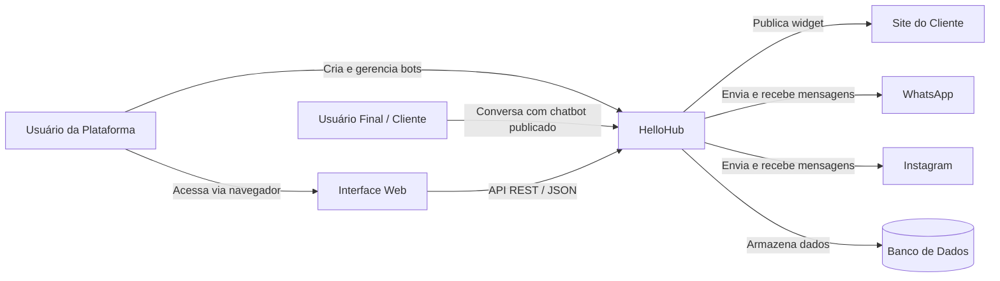
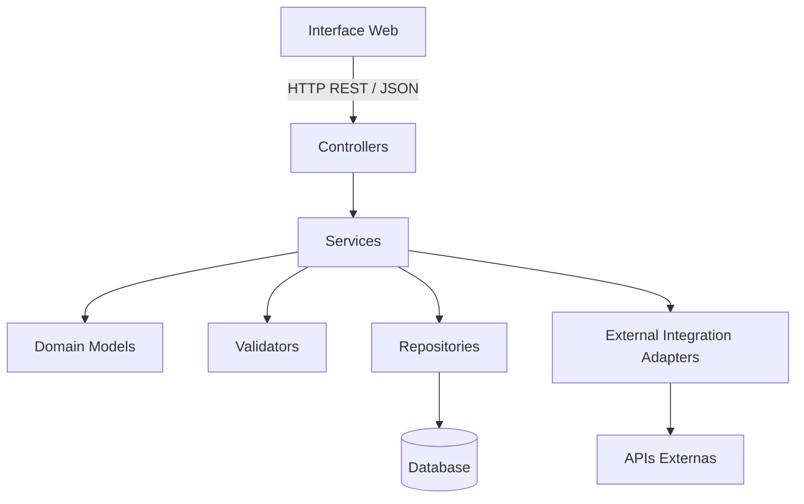
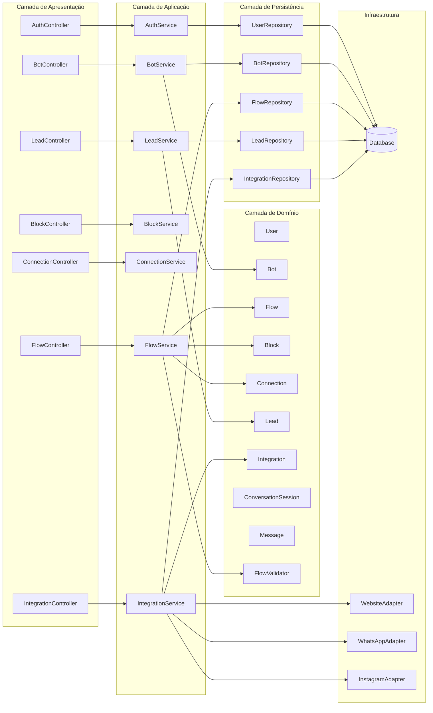
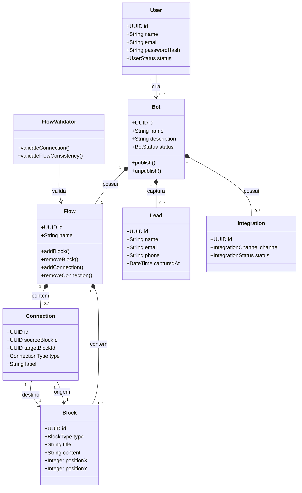
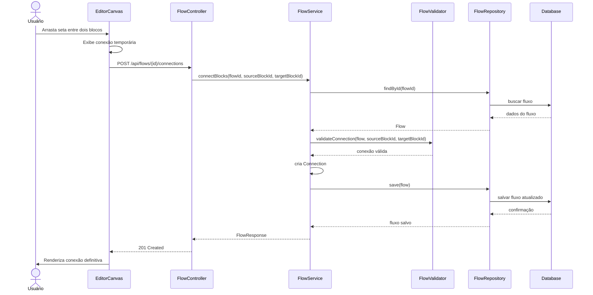
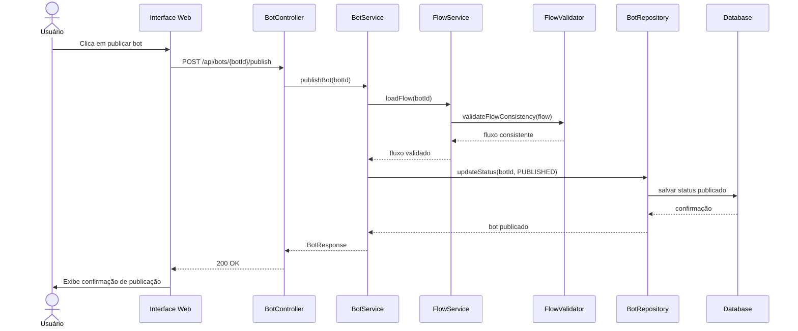
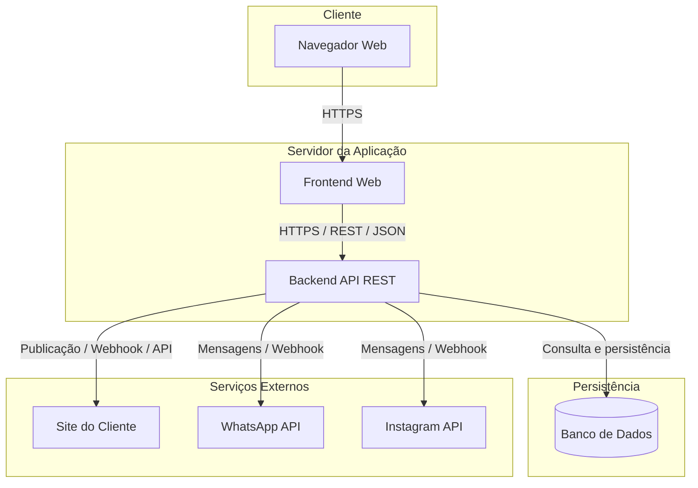
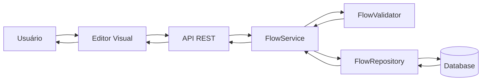

# Sprint 3 — Diagramas da Arquitetura do Sistema

## 1. Objetivo

Este documento apresenta as representações visuais da arquitetura do HelloHub.

Os diagramas têm como objetivo explicar:

* a visão geral do sistema;
* a organização em camadas;
* os principais componentes internos;
* o fluxo de comunicação entre frontend, backend e banco de dados;
* o funcionamento do caso de uso principal: conectar blocos no editor visual;
* a visão de implantação da solução.

---

## 2. Diagrama de Contexto

O diagrama de contexto mostra o HelloHub como sistema central e seus principais atores e integrações externas.

### Explicação

O usuário da plataforma cria e configura chatbots dentro do HelloHub.
O usuário final interage com o chatbot publicado em canais como site, WhatsApp ou Instagram.
O sistema armazena informações em banco de dados, incluindo usuários, bots, fluxos, leads e conversas.

---

## 3. Diagrama de Camadas

O diagrama abaixo representa a arquitetura em camadas adotada no projeto.

### Explicação

A interface web se comunica com o backend por meio de requisições REST.
Os controllers recebem as requisições e chamam os services.
Os services aplicam regras de negócio, usam validators e acessam repositories.
Os repositories fazem a comunicação com o banco de dados.
Adapters de integração são usados para comunicação com canais externos.

---

## 4. Diagrama de Componentes do Backend

### Explicação

Este diagrama detalha a organização interna do backend.
Controllers recebem chamadas externas.
Services executam casos de uso.
Models representam o domínio.
Repositories realizam persistência.
Adapters isolam integrações externas.

---

## 5. Diagrama do Domínio do Construtor Visual

O construtor visual é a funcionalidade central do HelloHub.
Ele é representado por um fluxo composto por blocos e conexões.

### Explicação

O fluxo do chatbot é representado como um grafo.
Cada `Block` é um nó e cada `Connection` é uma ligação entre dois nós.
Essa estrutura permite representar conversas de forma visual e flexível.

---

## 6. Diagrama de Sequência — Conectar Blocos

Este diagrama representa o caso de uso principal do editor visual: conectar dois blocos.

### Explicação

A interface apenas captura a ação do usuário.
A validação da conexão ocorre no backend.
O fluxo só é salvo se a conexão for válida.

---

## 7. Diagrama de Sequência — Publicar Bot

### Explicação

Antes da publicação, o sistema valida se o fluxo do bot está consistente.
Isso evita que um chatbot seja publicado com blocos desconectados ou regras inválidas.

---

## 8. Diagrama de Implantação

### Explicação

O usuário acessa o sistema pelo navegador.
O frontend se comunica com o backend via HTTPS e REST.
O backend acessa o banco de dados e integrações externas quando necessário.

---

## 9. Diagrama de Fluxo de Dados Simplificado

### Explicação

O fluxo de dados principal começa na interação do usuário com o editor visual.
A interface envia os dados para a API.
O backend valida, persiste e retorna o estado atualizado.

---

## 10. Conclusão

Os diagramas apresentados mostram que o HelloHub será estruturado com uma arquitetura em camadas, comunicação REST e separação clara entre interface, controllers, services, domínio, repositories, banco de dados e integrações externas.

Essa representação atende à Sprint 3 porque demonstra:

* como o sistema será estruturado;
* como as camadas se relacionam;
* quais componentes fazem parte da solução;
* como ocorre a comunicação entre frontend e backend;
* como o caso de uso principal funciona internamente.
